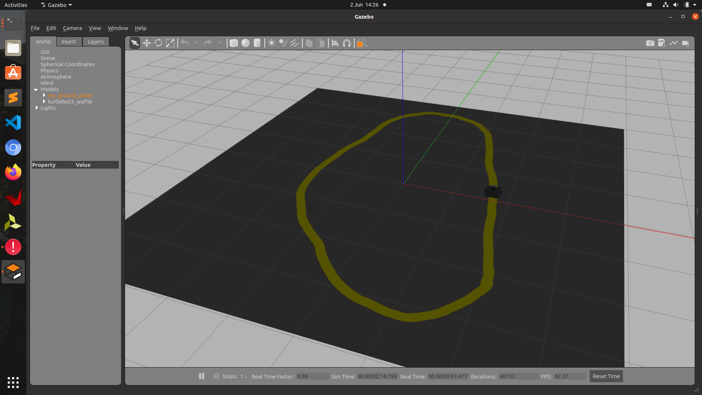

## Adversarial Driving in ROS




### Step 1: Collect Data

The following script collects image data from the topic **/camera/rgb/image_raw** and corresponding control command in **/cmd_vel**. The log file is saved  in **driving_log.csv**, and images are saved in **IMG/** folder

```
$ mkdir IMG 
$ python ros_collect_data.py
```


### Step 2: Train model

Once the data are collected, we can train a model that tracks the lane.

```
$ python model.py
```


### Step 3: Launch TurtleBot

```
$ export TURTLEBOT3_MODEL=waffle
$ cd ros_ws
$ catkin_make
$ source devel/setup.sh
$ roslaunch turtlebot3_gazebo turtlebot3_lane_world.launch
```


### Step 4: Attack

```
$ python ros_attack.py
```

