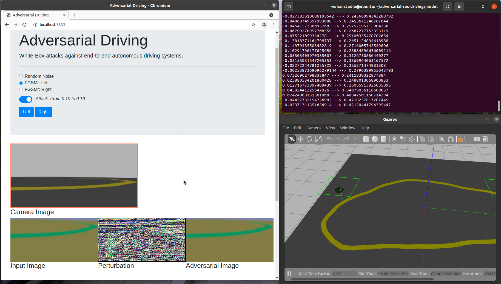

## Adversarial Driving in ROS

> Attacking End-to-End Autonomous Driving Systems

### Overview

The behaviour of end-to-end autonomous driving model can be manipulated by adding unperceivable perturbations to the input image.




### Quick Start

#### Step 0: Prerequisites

```
$ sudo apt install ros-noetic-desktop-full
$ sudo apt install ros-noetic-rosbridge-suite ros-noetic-turtlebot3-simulations ros-noetic-turtlebot3-gazebo ros-noetic-teleop-twist-keyboard

$ git clone https://github.com/wuhanstudio/adversarial-ros-driving
$ cd adversarial-ros-driving
```

#### Step 1: Setup the TurtleBot

```
$ cd ros_ws
$ rosdep install --from-paths src --ignore-src -r -y

$ catkin_make
$ source devel/setup.sh
$ export TURTLEBOT3_MODEL=waffle
$ roslaunch turtlebot3_lane turtlebot3_lane.launch

# You may need to put the turtlebot on track first
# rosrun teleop_twist_keyboard teleop_twist_keyboard.py
```

#### Step 2: Setup the server

```
$ roslaunch rosbridge_server rosbridge_websocket.launch

# For real turtlebot3
$ python3 drive.py --env turtlebot --model model_turtlebot.h5
# For Gazebo Simulator
$ python3 drive.py --env gazebo --model model_gazebo.h5

$ # If you use anaconda as your defaut python3 environment
$ pip3 install catkin_pkg empy defusedxml numpy twisted autobahn tornado pymongo pillow service_identity
```

The web page will be available at: http://localhost:8080/


That's it!

### Training the model

#### Step 1: Collect the Data

The following script collects image data from the topic **/camera/rgb/image_raw** and corresponding control command in **/cmd_vel**. The log file is saved  in **driving_log.csv**, and images are saved in **IMG/** folder

```
$ cd model/data
$ # Collect left camera data
$ python3 line_follow.py --camera left --env gazebo
$ python3 ros_collect_data.py --camera left --env gazebo
$ # Collect center camera data
$ python3 line_follow.py --camera center --env gazebo
$ python3 ros_collect_data.py --camera center --env gazebo
$ # Collect right camera data
$ python3 line_follow.py --camera right --env gazebo
$ python3 ros_collect_data.py --camera right --env gazebo
```

#### Step 2: Train the model

Once the data is collected, we can train a model that tracks the lane.

```
$ cd model
$ python3 model.py
```

## Adversarial Driving

We also tested our attacks in ROS Gazebo simulator. 

https://github.com/wuhanstudio/adversarial-driving

[](https://github.com/wuhanstudio/adversarial-driving)


## Citation

```
@misc{han2021driving,
  doi = {10.48550/ARXIV.2103.09151},
  url = {https://arxiv.org/abs/2103.09151},
  author = {Wu, Han and Yunas, Syed and Rowlands, Sareh and Ruan, Wenjie and Wahlstrom, Johan},
  title = {Adversarial Driving: Attacking End-to-End Autonomous Driving},
  publisher = {arXiv},
  year = {2021},
}
```
